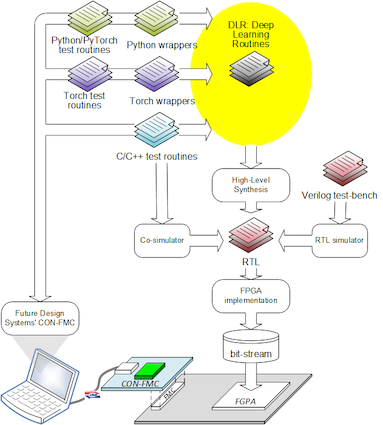
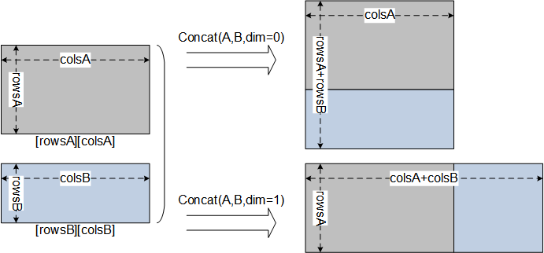
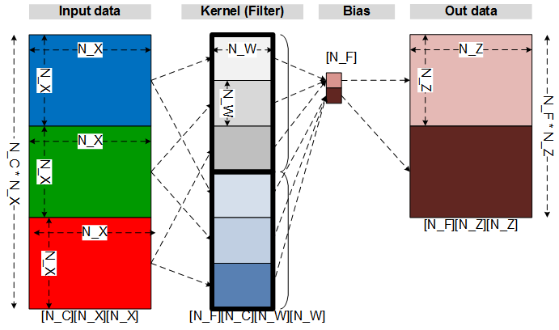
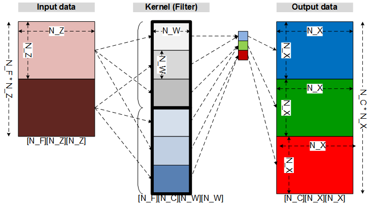

# DLR: Deep Learning Routine
'DLR (Deep Learning Routines)' as a part of DPU (Deep Learning Processing
Unit) is a collection of high-level synthesizable C/C++ routines for deep learning
inference network.

## Table of contents

<details><summary>Click to expand table of contents</summary>

1. [Overview](#overview)
   1. [Note](#note)
   2. [License](#license)
   3. [Prerequisites](#prerequisites)
   4. [Conventions](#conventions)
2. [Activation](#activation)
   1. [Hyperbolic tangent](#activation_tanh)
   2. [Leaky ReLU](#activation_leaky_relu)
   3. [ReLU](#activation_relu)
   4. [Signmoid](#activation_relu)
3. [Concatenation](#concatenation)
   1. [Concat2d](#concatenation_concat2d)
4. [Convolution](#convolution)
   1. [Convolution2d](#convolution_convolution2d)
5. [Deconvolution](#deconvolution)
   1. [Deconvolution2d](#deconvolution_deconvolution2d)
6. [Linear (Fully connected)](#linear)
7. [Normalization](#normalization)
   1. [Batch normalization](#normalization_batch_normalization)
8. [Pooling](#pooling)
   1. [Average pooling](#pooling_average)
   2. [Max pooling](#pooling_max)
9. [Project: LeNet-5](#project_lenet5)
10. [Acknowledgment](#acknowledgment)
11. [Authors and contributors](#authors_and_contributors)
11. [Revision history](#revision_history)

</details>

---
# Overview<a name="overview"></a>
'DLR (Deep Learning Routines)' as a part of DPU (Deep Learning Processing
Unit) is a collection of high-level synthesizable C/C++ routines for deep learning
inference network.

As shown in the picture below, DLR routines are verified in the context of C/C++, Python, PyTorch, and FPGA.

|  |
|:---:|
| *Overall framework* |

DLR routines contain followings (some are under development and more will be added):
* Convolution layer (strict convolution )
* Activation layer (ReLU, Leaky ReLU, hyperbolic tangent, sigmoid)
* Pooling layer (max, average)
* Fully connected layer (linear layer)
* De-convolution layer (transposed convolution layer)
* Batch normalization layer
* Concatenation layer

The routines have following highlights:
* Fully synthesizable C code
* Highly parameterized to be adopted wide range of usages
* C, Python, PyTorch, Verilog test-benches
* FPGA verified using Future Design Systems’ CON-FMC

### Note<a name="note"></a>
It should be noted that the routines are not optimized to get a higher
performance since the routines are for hardware implementation not for
computation. In addition to this the routines are only for inference not for training.

### License<a name="license"></a>
DLR (Deep Learning Routines) and its associated materials are licensed with
the 2-clause BSD license to make the program and library useful in open and
closed source products independent of their licensing scheme.
Each contributor holds copyright over their respective contribution.

<details><summary>The 2-Clause BSD License</summary>
Copyright 2020 Future Design Systems (http:://www.future-ds.com)

Redistribution and use in source and binary forms, with or without modification, are permitted provided that the following conditions are met:

1. Redistributions of source code must retain the above copyright notice, this list of conditions and the following disclaimer.

2. Redistributions in binary form must reproduce the above copyright notice, this list of conditions and the following disclaimer in the documentation and/or other materials provided with the distribution.

THIS SOFTWARE IS PROVIDED BY THE COPYRIGHT HOLDERS AND CONTRIBUTORS "AS IS" AND ANY EXPRESS OR IMPLIED WARRANTIES, INCLUDING, BUT NOT LIMITED TO, THE IMPLIED WARRANTIES OF MERCHANTABILITY AND FITNESS FOR A PARTICULAR PURPOSE ARE DISCLAIMED. IN NO EVENT SHALL THE COPYRIGHT HOLDER OR CONTRIBUTORS BE LIABLE FOR ANY DIRECT, INDIRECT, INCIDENTAL, SPECIAL, EXEMPLARY, OR CONSEQUENTIAL DAMAGES (INCLUDING, BUT NOT LIMITED TO, PROCUREMENT OF SUBSTITUTE GOODS OR SERVICES; LOSS OF USE, DATA, OR PROFITS; OR BUSINESS INTERRUPTION) HOWEVER CAUSED AND ON ANY THEORY OF LIABILITY, WHETHER IN CONTRACT, STRICT LIABILITY, OR TORT (INCLUDING NEGLIGENCE OR OTHERWISE) ARISING IN ANY WAY OUT OF THE USE OF THIS SOFTWARE, EVEN IF ADVISED OF THE POSSIBILITY OF SUCH DAMAGE.
</details>

### Prerequisites<a name="prerequisites"></a>
This program requires followings.
* GNU GCC: C compiler
* Python
* PyTorch
* HDL simulator: Xilinx Xsim
* High level synthesis: Xilinx Vivado HLS

### Conventions<a name="conventions"></a>
Each DLR routines have C++ and C routines, where templates are used for C++.
Python wrappers follow C++ name.
PyTorch wrappers follow PyTorch torch.nn.functioan name.

## Activation<a name="activation"></a>

<details><summary>Click to expand this section</summary>

### 1. Hyperbolic tangent<a name="activation_tanh"></a>

### 2. Leaky ReLU<a name="activation_leaky_relu"></a>

### 3. ReLU<a name="activation_relu"></a>

### 4. Signmoid<a name="activation_relu"></a>

</details>

## Concatenation<a name="concatenation"></a>

<details><summary>Click to expand this section</summary>

### 1. Concat2d<a name="concatenation_concat2d"></a>

|  |
|:---:|
| *Concatenation* |

</details>

## Convolution<a name="convolution"></a>

<details><summary>Click to expand this section</summary>

### 1. Convolution2d<a name="convolution_convolution2d"></a>
'Convolution2d()' applies a 2D convolution over an input data composed of multiple planes (i.e., channels).

|  |
|:---:|
| *COnvolutioin* |

#### 1.1. C++ routine<a name="convolution2d_cpp"></a>
C++ routines uses template to support user specific data type.

<details><summary>Click to expand C++ code</summary>

```
template<class TYPE=float>
void Convolution2d
(           TYPE     *out_data    // out_channel x out_size x out_size
    , const TYPE     *in_data     // in_channel x in_size x in_size
    , const TYPE     *kernel      // out_channel x in_channel x kernel_size x kernel_size
    , const TYPE     *bias        // out_channel
    , const uint16_t  out_size    // only for square matrix
    , const uint16_t  in_size     // only for square matrix
    , const uint8_t   kernel_size // only for square matrix
    , const uint16_t  bias_size   // out_channel
    , const uint16_t  in_channel  // number of input channels
    , const uint16_t  out_channel // number of filters (kernels)
    , const uint8_t   stride
    , const uint8_t   padding=0
    #if !defined(__SYNTHESIS__)
    , const int       rigor=0   // check rigorously when 1
    , const int       verbose=0 // verbose level
    #endif
)
```

</details>

#### 1.2. C routine<a name="convolution2d_c"></a>
C routines are build by overloading template of corresponding C++ routine.

<details><summary>Click to expand C code</summary>

```
extern void Convolution2dInt
(           int      *out_data    // out_channel x out_size x out_size
    , const int      *in_data     // in_channel x in_size x in_size
    , const int      *kernel      // in_channel x out_channel x kernel_size x kernel_size
    , const int      *bias        // bias per kernel
    , const uint16_t  out_size    // only for square matrix
    , const uint16_t  in_size     // only for square matrix
    , const uint8_t   kernel_size // only for square matrix
    , const uint16_t  bias_size   // number of biases, it should be the same as out_channel
    , const uint16_t  in_channel  // number of input channels
    , const uint16_t  out_channel // number of filters (kernels)
    , const uint8_t   stride      // stride default 1
    , const uint8_t   padding     // padding default 0
    #if !defined(__SYNTHESIS__)
    , const int       rigor       // check rigorously when 1
    , const int       verbose     // verbose level
    #endif
);
extern void Convolution2dDouble( ); // arguments are the same as Concat2dFloat, but data type is 'double' instead of 'float'
extern void Convolution2dInt( ); // arguments are the same as Concat2dFloat, but data type is 'double' instead of 'int'
```

</details>

#### 1.3. Python wrapper<a name="convolution2d_python"></a>
‘Convolution2d()’ wrapper gets NumPy arguments for array and ‘out_data’
carries calculated result. It returns ‘True’ on success or ‘False’ on failure.

<details><summary>Click to expand Python code</summary>

```
Convolution2d( out_data    # out_channel x out_size x out_size
             , in_data     # in_channel x in_size x in_size
             , kernel      # out_channel x in_channel x kernel_size x kernel_size
             , bias=None   # out_channel
             , stride=1
             , padding=0
             , rigor=False
             , verbose=False)
```

</details>

#### 1.4. PyTorch wrapper<a name="convolution2d_pytorch"></a>
‘conv2d()’ PyTorch wrapper gets PyTorch tensor arguments for array and
returns calculated result. It calls Python wrapper after converting PyTorch tensor
to NumPy array.

<details><summary>Click to expand PyTorch code</summary>

```
conv2d( input     # in_minibatch x in_channel x in_size x in_size
      , weight    # out_channel  x in_channel x kernel_size x kernel_size
      , bias=None # out_channel
      , stride=1
      , padding=0
      , dilation=1
      , groups=1
      , rigor=False
      , verbose=False)
```

</details>

</details>

## Deconvolution<a name="deconvolution"></a>

<details><summary>Click to expand this section</summary>

### 1. Deconvolution2d<a name="deconvolution_deconvolution2d"></a>

|  |
|:---:|
| *Deconvolution (Transposed convolution)* |

</details>

## Linear (Fully connected)<a name="linear"></a>

<details><summary>Click to expand this section</summary>

|  |
|:---:|
| *Linear* |

</details>

## Normalization<a name="normalization"></a>

<details><summary>Click to expand this section</summary>

### 1. Batch normalization<a name="normalization_batch_normalization"></a>

|  |
|:---:|
| *Batch normaization* |

</details>

## Pooling<a name="pooling"></a>

<details><summary>Click to expand this section</summary>

### 1. Average pooling<a name="pooling_average"></a>

### 2. Max pooling<a name="pooling_max"></a>

</details>


## Project: LeNet-5<a name="project_lenet5"></a>

<details><summary>Click to expand this project</summary>

|  |
|:---:|
| *NeNet-5 network* |

|  |
|:---:|
| *NeNet-5 network details* |

</details>

---
### Acknowledgment<a name="acknowledgment"></a>
This work was supported partially by KARI (Korea Aerospace Research
Institute) under the “Development of deep learning hardware accelerator for
microsatellite ” (Contract 2019110A35C-00).<br>
Some part of this work was carried out partially by Handong Global University
2020 Summer Internship program.<br>
Some part of this work was supported partially by ETRI (Electronics and
Telecommunications Research Institute) under the “Development and training of
FPGA-based AI semiconductor design environment ” (Contract EA20202206).

### Authors and contributors<a name="authors_and_contributors"></a>
* **[Ando Ki]** - *Initial work* - <a href="http://www.future-ds.com" target="_blank">Future Design Systems</a>
* **Seongwon Seo** <a href="http://www.future-ds.com" target="_blank">Future Design Systems</a>
* **Kwangsub Jeon** - <a href="http://www.future-ds.com" target="_blank">Future Design Systems</a>
* **Chae Eon Lim** - <a href="http://www.future-ds.com" target="_blank">Future Design Systems</a>

### Revision history<a name="revision_history"></a>
* 2020.11.12: Released
* 2020.03.10: Started by Ando Ki (adki at future-ds.com)
